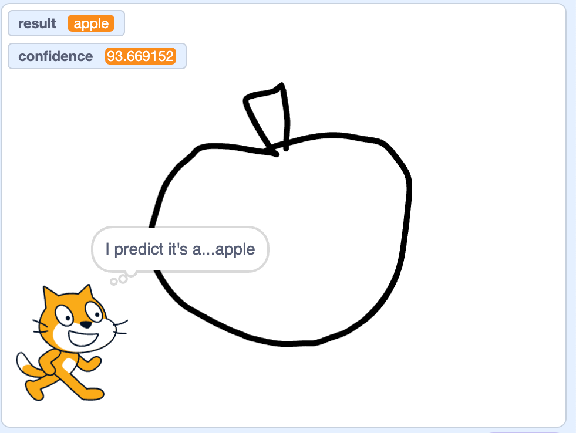

## Τι θα φτιάξεις

Train a machine learning model to recognise what you have drawn.

\--- collapse ---

---

## title: Πού αποθηκεύονται οι εικόνες μου;

- Αυτό το έργο χρησιμοποιεί μια τεχνολογία που ονομάζεται «μηχανική μάθηση». Machine learning systems are trained using a large amount of data.
- Αυτό το έργο δεν απαιτεί να δημιουργήσεις λογαριασμό ή να συνδεθείς. Γι' αυτό το έργο, τα παραδείγματα εικόνων που χρησιμοποιείς για να δημιουργήσεις το μοντέλο αποθηκεύονται μόνο προσωρινά στο πρόγραμμα περιήγησής σου (μόνο στον υπολογιστή σου).

\--- /collapse ---

## --- collapse ---

## title: Δεν υπάρχει πρόβαση στο YouTube; Κάνε λήψη των βίντεο!

Μπορείς να [κατεβάσεις όλα τα βίντεο γι' αυτό το έργο](https://rpf.io/p/en/doodle-detector-go){:target="_blank"}.

\--- /collapse ---