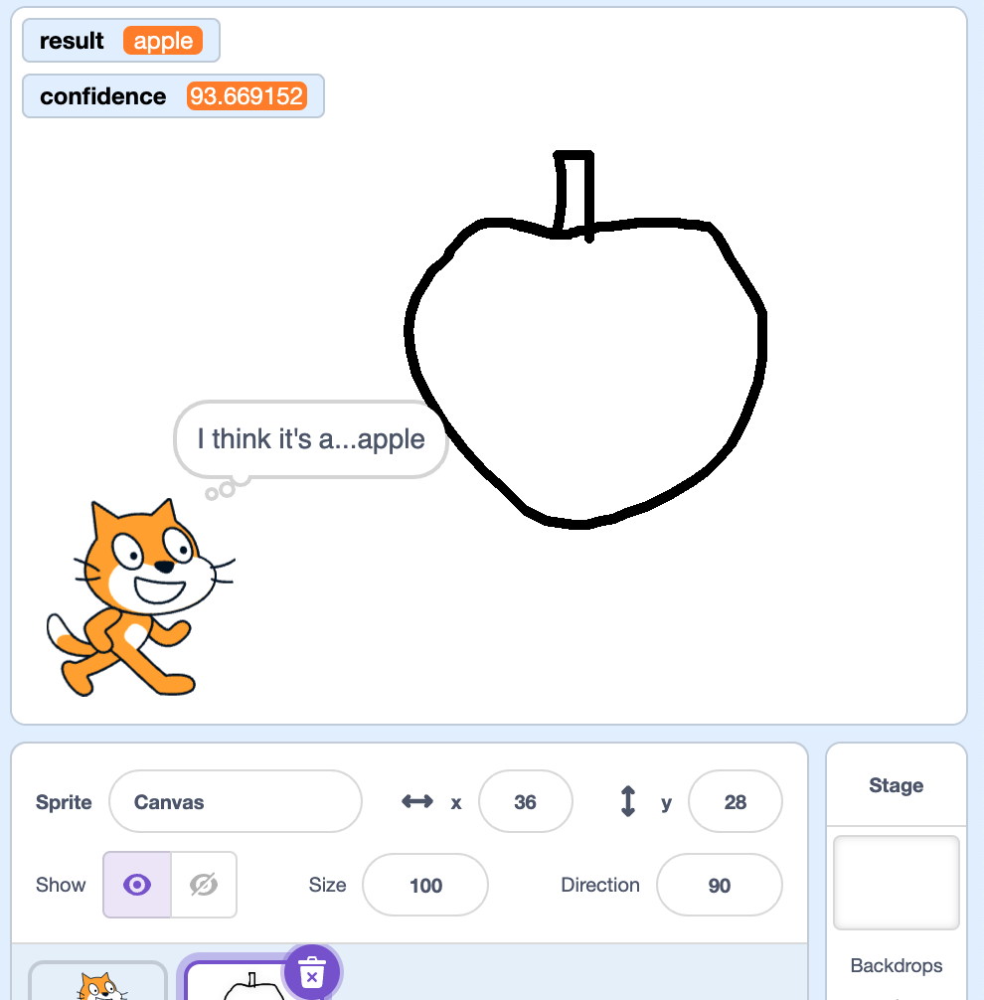

## What you will make

Train a machine learning model to recognise what you have drawn.

--- collapse ---

---
title: Where are my images stored?
---

- This project uses a technology called 'machine learning'. Machine learning systems are trained using a large amount of data. 
- This project does not require you to create an account or log in. For this project, the image examples you use to make the model are only stored temporarily in your browser (only on your machine).
--- /collapse ---

--- collapse ---
---
title: No YouTube? Download the videos!
---

You can [download all the videos for this project](https://rpf.io/p/en/doodle-detector-go){:target="_blank"}. 

--- /collapse ---