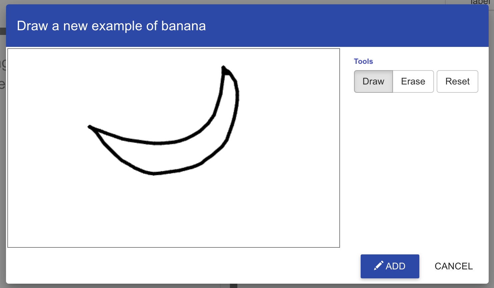
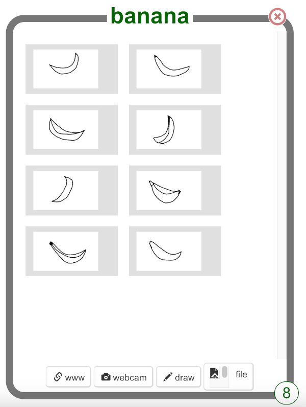

## Draw some examples

<html>

<iframe style="position: absolute; top: 0; left: 0; right: 0; width: 100%; height: 100%; border: none;" src="https://www.youtube.com/embed/VeOEJRXMZCQ?rel=0&cc_load_policy=1" width="560" height="315" allowfullscreen allow="accelerometer; autoplay; clipboard-write; encrypted-media; gyroscope; picture-in-picture; web-share"></iframe>

</html>

You are going to draw two different images several times. This will teach your machine learning model to tell the difference between the two things you will draw. We have chosen a banana and an apple, but you can choose other things to draw if you prefer.

--- task ---
+ Click on **+ Add new label** on the top right of the screen and add a label called `banana`. 
--- /task ---

--- task ---
+ Click the **Draw** button in **banana**.
--- /task ---

--- task ---
+ Draw a picture of a banana in the box.

+ Click the **Add** button to save your drawing.
--- /task ---

--- task ---
+ Repeat those steps until you have **at least eight examples** of bananas. Try to draw them in different ways so there is a variety.

--- /task ---

--- task ---
+ Click on **+ Add new label** on the top right of the screen and add a label called `apple`.
--- /task ---

--- task ---
+ Click on **Draw** inside the box for the new `apple` label, and draw a picture of an apple. 

+ Repeat until you have drawn **at least eight examples** of apples.
--- /task ---

