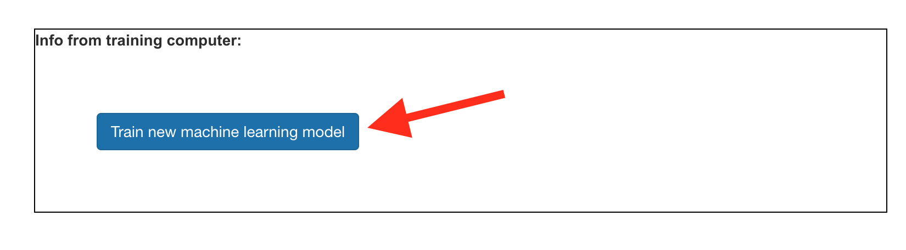
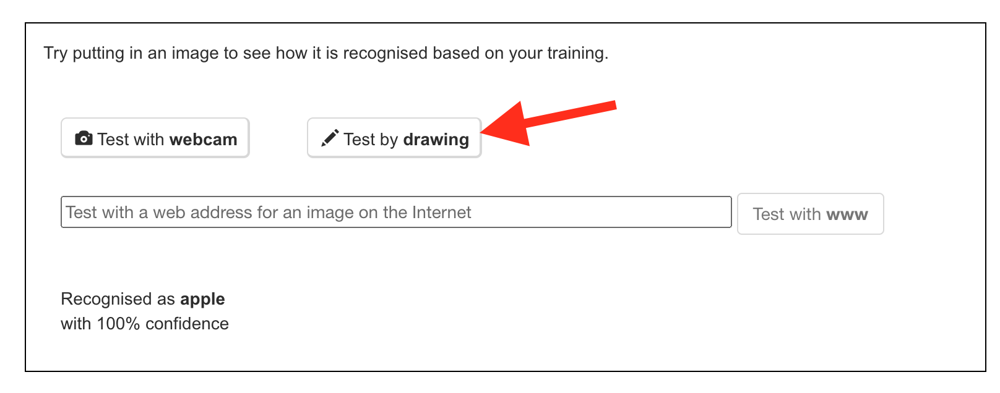

## Train the model

<html>
  

    <iframe style="position: absolute; top: 0; left: 0; right: 0; width: 100%; height: 100%; border: none;" src="https://www.youtube.com/embed/hOlwcvmK3HQ?rel=0&cc_load_policy=1" allowfullscreen allow="accelerometer; autoplay; clipboard-write; encrypted-media; gyroscope; picture-in-picture; web-share"></iframe>
  

</html>

You have gathered the examples you need, now you will use these examples to train your machine learning model.

--- task ---

+ Click on **Back to project** in the top left-hand corner.

+ Click on **Learn & Test**.

+ Click on the button labelled **Train new machine learning model**. This may take a few minutes to complete.

--- /task ---

Once the training has finished, you can test how well your model recognises drawings of each type of object.  

--- task ---

+ Click the **Test by drawing** button, then draw a picture of an apple. 

Your machine learning model will display its prediction for what you drew.

--- /task ---

--- task ---
+ Test whether the model recognises a drawing of a banana as well.
--- /task ---

If you are not happy with how the model is working, go back to the **Train** page and add more examples, then train your model again.

