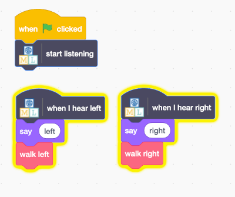

## Create a canvas

Now that your model can distinguish between drawings, you can use it in a Scratch program.

--- task ---
+ Click on the **< Back to project** link.

+ Click on **Make**.

+ Click on **Scratch 3**.

+ Click on **Open in Scratch 3**.

--- /task ---

Machine Learning for Kids has added some special blocks to Scratch to allow you to use the model you just trained. Find them at the bottom of the blocks list.

--- task ---

+ Make sure you have the **Alien** sprite selected, then click on the **Code** tab and add this code. (Keep the code that is already there!)

--- /task ---

--- task ---
+ Click the **green flag** and say your alien words for "left" and "right". Check that the alien moves in the way you expected. 

--- /task ---

