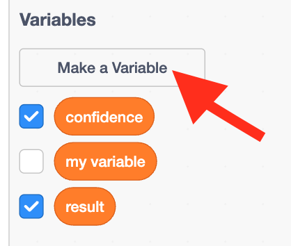

## Create a canvas

Now that your model can distinguish between drawings, you can use it in a Scratch program.

--- task ---
+ Click on the **< Back to project** link.

+ Click on **Make**.

+ Click on **Scratch 3**.

+ Click on **Open in Scratch 3**.

--- /task ---

Machine Learning for Kids has added some special blocks to Scratch to allow you to use the model you just trained. Find them at the bottom of the blocks list.

--- task ---

+ Create a new sprite using the 'Paint' option. Name your sprite 'Canvas'.

--- /task ---

--- task ---
+ Click the purple **Convert to bitmap** button at the bottom, underneath the drawing area.
--- /task ---

--- task ---
+ Click on the **Code tab** for the canvas sprite and create two **variables** called `result` and `confidence`.

--- /task ---

--- task ---
+ Drag in the correct blocks to set the value of these variables when the space key is pressed. Create a **broadcast** called `detected` and broadcast it once the variables are set.

--- /task ---

