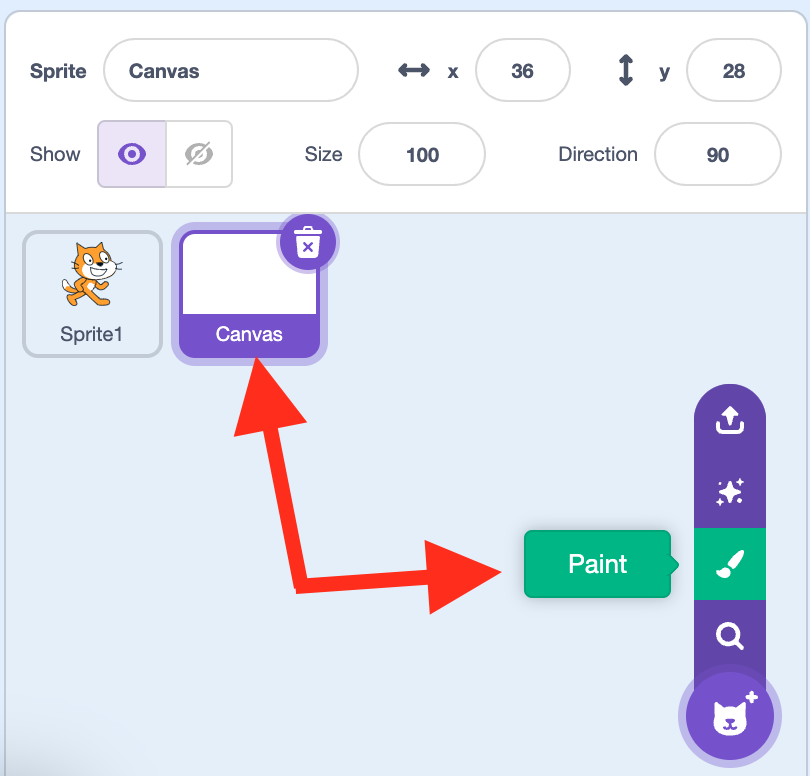
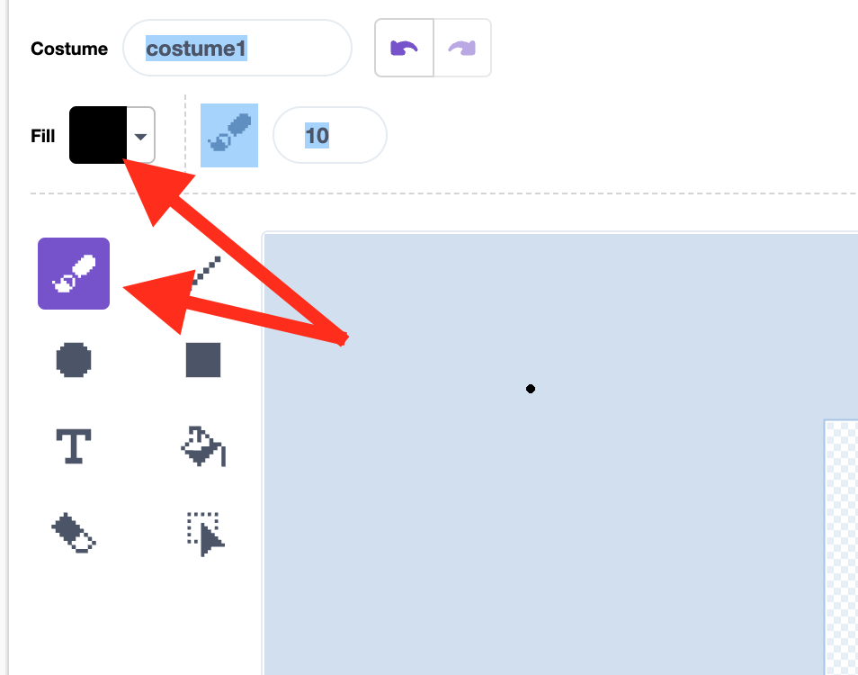
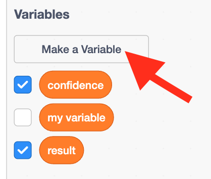
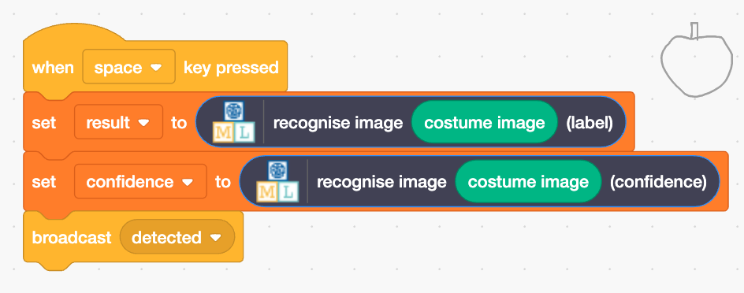

## What was it?

The cat sprite will announce what it thinks you have drawn.

--- task ---

+ Create a new sprite using the 'Paint' option. Name your sprite 'Canvas'

--- /task ---

--- task ---
+ Click the purple **Convert to bitmap** option at the bottom, underneath the drawing area.
--- /task ---

--- task ---
+ Select the **paint brush** tool and change the **fill** colour to black. 

--- /task ---

--- task ---
+ Click on the **Code tab** for the canvas sprite and create two **variables** called `result` and `confidence`.

--- /task ---

--- task ---
+ Drag in the correct blocks to set the value of these variables when the space bar is clicked. Create a **broadcast** called `detected` and broadcast it once the variables are set.

--- /task ---

