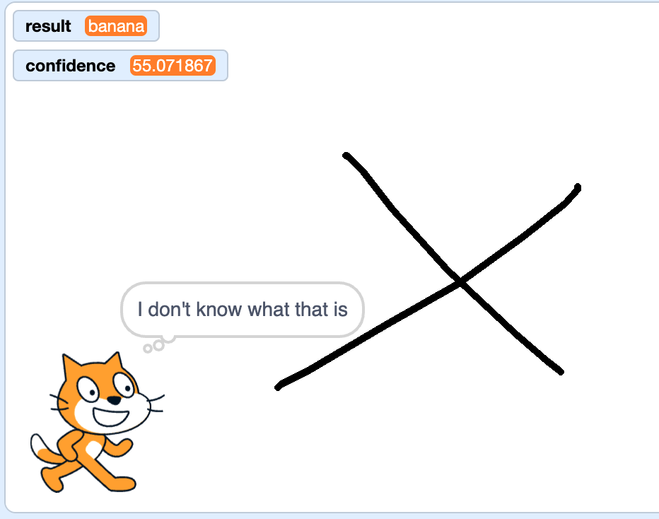

## What was it?

<html>
  <div style="position: relative; overflow: hidden; padding-top: 56.25%;">
    <iframe style="position: absolute; top: 0; left: 0; right: 0; width: 100%; height: 100%; border: none;" src="https://www.youtube.com/embed/r1ZBEUrheus?rel=0&cc_load_policy=1" allowfullscreen allow="accelerometer; autoplay; clipboard-write; encrypted-media; gyroscope; picture-in-picture; web-share"></iframe>
  </div>
</html>

The cat sprite will announce what it predicts you have drawn.

--- task ---

+ Click on the cat sprite. Add some code so that the cat tells you what it predicts you drew.

```blocks3
when I receive [detected v]
think (join [I predict it's a...] (result)) for (2) seconds
```

--- /task ---


--- task ---
+ Click on the canvas sprite, then click on the **costumes tab**.

+ Select the **paint brush** tool and change the **fill** colour to black. 


--- /task ---

--- task ---
+ Use the paint brush to draw a large apple. When you are finished, press the space bar and see what the cat predicts you drew. 


--- /task ---

--- task ---
+ You can add more code so that the cat sprite will only tell you the result if the confidence level is over 70. 

```blocks3
when I receive [detected v]
if <(confidence)>(70)> then
think (join [I predict it's a...] (result)) for (2) seconds
else
think [I don't know what that is] for (2) seconds
```
--- /task ---

--- task ---
+ Click on the canvas and this time draw something completely different. See whether the cat thinks you drew an apple, a banana, or isn't sure.



--- /task ---
