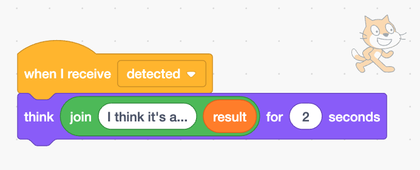
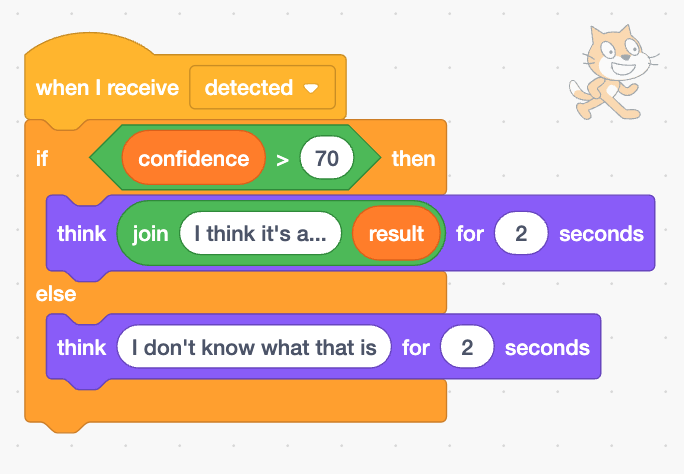

## What was it?

The cat sprite will announce what it predicts you have drawn.

--- task ---

+ Click on the cat sprite. Add some code so that the cat tells you what it predicts you drew.

--- /task ---

--- task ---
+ Click on the canvas sprite, then click on the **costumes tab**.

+ Select the **paint brush** tool and change the **fill** colour to black. 

--- /task ---

--- task ---
+ Use the paint brush to draw a large apple. When you are finished, press the space bar and see what the cat predicts you drew. 

--- /task ---

--- task ---
+ You can add more code so that the cat sprite will only tell you the result if the confidence level is over 70. 

--- /task ---

--- task ---
+ Click on the canvas and this time draw something completely different. See whether the cat thinks you drew an apple, a banana, or isn't sure.

--- /task ---
