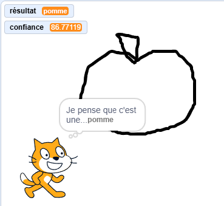

## Ce que tu vas faire

Entraîne un modèle d’apprentissage automatique pour reconnaître ce que tu as dessiné.

--- collapse ---

---
title: Où sont stockées mes images ?
---

- Ce projet utilise une technologie appelée « apprentissage automatique ». Les systèmes d'apprentissage automatique sont entraînés à l'aide d'une grande quantité de données.
- Ce projet ne nécessite pas la création d'un compte ou d'une connexion. Pour ce projet, les exemples d'images que tu utilises pour réaliser le modèle ne sont stockés que temporairement dans ton navigateur (uniquement sur ta machine).

--- /collapse ---

--- collapse ---
---
title: Pas de YouTube ? Télécharge les vidéos !
---

Tu peux [télécharger l'ensemble des vidéos de ce projet](https://rpf.io/p/fr-FR/doodle-detector-go){:target="_blank"}.

--- /collapse ---