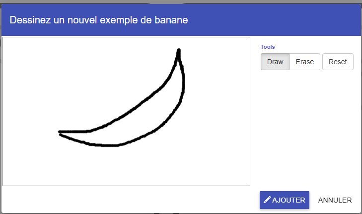
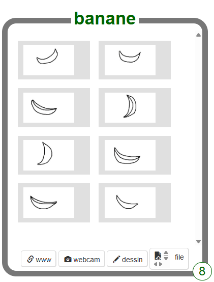

## Dessiner quelques exemples

<html>
  

    <iframe style="position: absolute; top: 0; left: 0; right: 0; width: 100%; height: 100%; border: none;" src="https://www.youtube.com/embed/Y_2luFeY89w?rel=0&cc_load_policy=1" allowfullscreen allow="accelerometer; autoplay; clipboard-write; encrypted-media; gyroscope; picture-in-picture; web-share"></iframe>
  

</html>

Tu as dessiné plusieurs fois deux images différentes. Cela apprendra à ton modèle d’apprentissage automatique à faire la différence entre les deux choses que tu as dessinées. Nous avons choisi une banane et une pomme, mais tu peux choisir d'autres choses à dessiner si tu préfères.

\--- task ---

- Clique sur **+ Ajouter une nouvelle étiquette** en haut à droite de l'écran et ajoute une étiquette appelée « banane ».

\--- /task ---

\--- task ---

- Clique sur le bouton **dessin** dans **banane**.

\--- /task ---

\--- task ---

- Dessine une banane dans la boîte.

- Clique sur le bouton **Ajouter** pour enregistrer ton dessin.

\--- /task ---

\--- task ---

- Répète ces étapes jusqu'à obtenir **au moins huit exemples** de bananes. Essaie de les dessiner de différentes manières pour qu'il y ait de la variété.
  

\--- /task ---

\--- task ---

- Clique sur **+ Ajouter une nouvelle étiquette** en haut à droite de l'écran et ajoute une étiquette appelée « pomme ».

\--- /task ---

\--- task ---

- Clique sur **dessin** à l'intérieur de la case pour la nouvelle étiquette « pomme » et dessine une image d'une pomme.

- Répète jusqu’à ce que tu aies dessiné **au moins huit exemples** de pommes.

\--- /task ---

