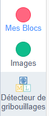
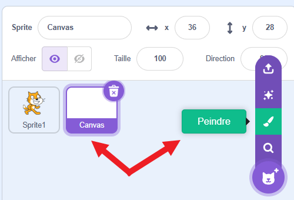
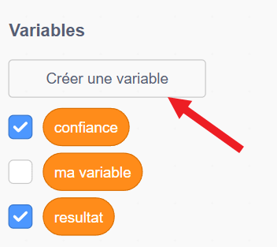
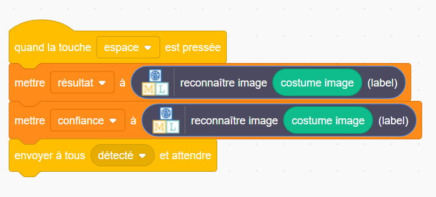

## Créer un canvas

<html>
  

    <iframe style="position: absolute; top: 0; left: 0; right: 0; width: 100%; height: 100%; border: none;" src="https://www.youtube.com/embed/VnE5kMsPJOI?rel=0&cc_load_policy=1" allowfullscreen allow="accelerometer; autoplay; clipboard-write; encrypted-media; gyroscope; picture-in-picture; web-share"></iframe>
  

</html>

Maintenant que ton modèle peut distinguer les dessins, tu peux l'utiliser dans un programme Scratch.

--- task ---

- Clique sur le lien **< Revenir au projet**.

- Clique sur **Faire**.

- Clique sur **Scratch 3**.

- Clique sur **Ouvrir dans Scratch 3**.

--- /task ---

Machine Learning for Kids a ajouté des blocs spéciaux à Scratch pour te permettre d'utiliser le modèle que tu viens d'entraîner. Trouve-les en bas de la liste des blocs.

--- task ---

- Crée un nouveau sprite en utilisant l'option « Peindre ». Nomme ton sprite « Canvas ».

--- /task ---

--- task ---

- Clique sur le bouton violet **Convertir en bitmap** en bas, sous la zone de dessin.

--- /task ---

--- task ---

- Clique sur l'onglet **Code** pour le sprite du canvas et crée deux **variables** appelées « résultat » et « confiance ».

--- /task ---

--- task ---

- Fais glisser les blocs corrects pour définir la valeur de ces variables lorsque la touche espace est enfoncée. Crée un **message** appelé « détecté » et envoie-la une fois les variables définies.

--- /task ---

