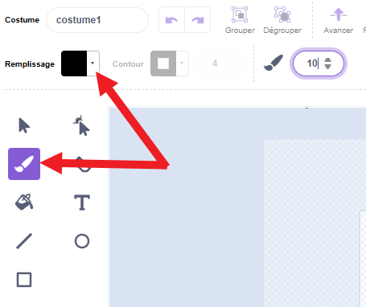
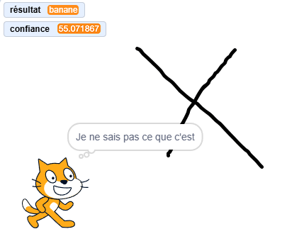

## C'était quoi ?

<html>
  <div style="position: relative; overflow: hidden; padding-top: 56.25%;">
    <iframe style="position: absolute; top: 0; left: 0; right: 0; width: 100%; height: 100%; border: none;" src="https://www.youtube.com/embed/r1ZBEUrheus?rel=0&cc_load_policy=1" allowfullscreen allow="accelerometer; autoplay; clipboard-write; encrypted-media; gyroscope; picture-in-picture; web-share"></iframe>
  </div>
</html>

Le sprite chat annoncera ce qu'il prédit que tu as dessiné.

--- task ---

- Clique sur le sprite chat. Ajoute du code pour que le chat te dise ce qu'il pense que tu as dessiné.

```blocks3
when I receive [détecté v]
think (join [Je pense que c'est une...] (résultat)) for (2) seconds
```

--- /task ---

--- task ---

- Clique sur le sprite canvas, puis sur l'onglet **Costumes**.

- Sélectionne l'outil **pinceau** et change la couleur de **remplissage** en noir.


--- /task ---

--- task ---

- Utilise le pinceau pour dessiner une grosse pomme. Lorsque tu as terminé, appuie sur la barre d'espace et vois ce que le chat pense que tu as dessiné.


--- /task ---

--- task ---

- Tu peux ajouter plus de code pour que le sprite chat ne t'indique le résultat que si le niveau de confiance est supérieur à 70.

```blocks3
when I receive [détecté v]
if <(confiance)>(70)> then
think (join [Je pense que c'est une...] (résultat)) for (2) seconds
else
think [Je ne sais pas ce que c'est] for (2) seconds
```
--- /task ---

--- task ---

- Clique sur le canvas et cette fois, dessine quelque chose de complètement différent. Vois si le chat pense que tu as dessiné une pomme, une banane ou s'il n'est pas sûr.



--- /task ---
