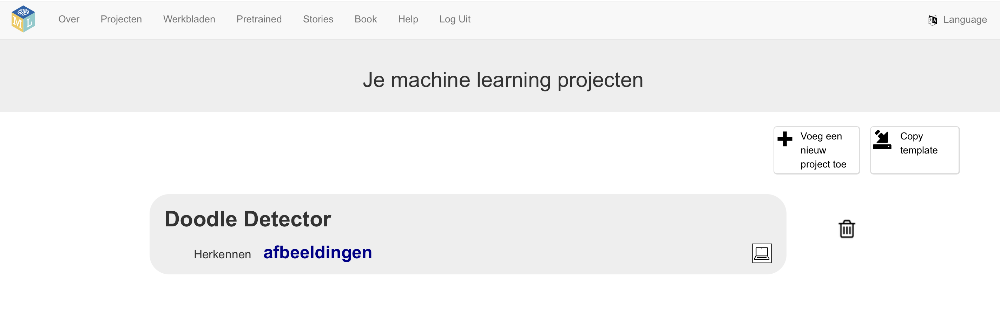

## Het project opzetten

<html>
  

    <iframe style="position: absolute; top: 0; left: 0; right: 0; width: 100%; height: 100%; border: none;" src="https://www.youtube.com/embed/jXLQt079DNY?rel=0&cc_load_policy=1" allowfullscreen allow="accelerometer; autoplay; clipboard-write; encrypted-media; gyroscope; picture-in-picture; web-share"></iframe>
  

</html>

\--- task ---

- Ga naar [machinelearningforkids.co.uk](https://machinelearningforkids.co.uk/){:target="_blank"} in een webbrowser.

- Klik op **Begin**

- Klik op 'Probeer nu\*\*.

\--- /task ---

\--- task ---

- Klik op **Projecten** in de menubalk bovenaan.

- Klik op de knop **+ Voeg een nieuw project toe**.

- Geef je project de naam `Doodle detector` en stel het in om **afbeeldingen** te herkennen en gegevens **in je webbrowser** op te slaan. Klik vervolgens op **Creëer**.
  

- Je zou nu 'Doodle detector' in de lijst met projecten moeten zien. Klik op dit project.
  

\--- /task ---

\--- task ---

- Klik op de knop **Train**.
  

\--- /task ---

