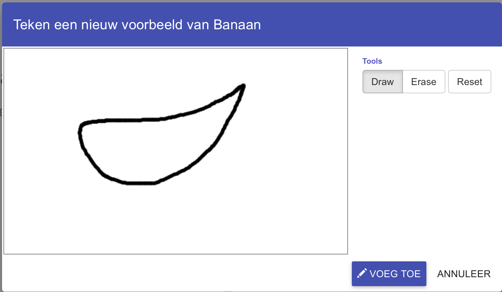
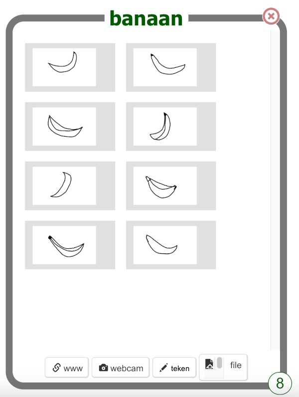

## Teken enkele voorbeelden

<html>
  

    <iframe style="position: absolute; top: 0; left: 0; right: 0; width: 100%; height: 100%; border: none;" src="https://www.youtube.com/embed/Y_2luFeY89w?rel=0&cc_load_policy=1" allowfullscreen allow="accelerometer; autoplay; clipboard-write; encrypted-media; gyroscope; picture-in-picture; web-share"></iframe>
  

</html>

Je gaat twee verschillende afbeeldingen meerdere keren tekenen. Hiermee leert jouw machine learning-model het verschil te herkennen tussen de twee dingen die jij tekent. Wij hebben een banaan en een appel gekozen, maar je kunt natuurlijk ook andere dingen tekenen.

\--- task ---

- Klik rechtsboven in het scherm op **+ Voeg een nieuw label toe** en voeg een label toe met de naam `banaan`.

\--- /task ---

\--- task ---

- Klik op de **Teken**-knop in **banaan**.

\--- /task ---

\--- task ---

- Teken een banaan in het vakje.

- Klik op de knop **Voeg Toe** om jouw tekening op te slaan.

\--- /task ---

\--- task ---

- Herhaal deze stappen totdat je **ten minste acht voorbeelden** van bananen hebt. Probeer ze op verschillende manieren te tekenen, zodat er variatie ontstaat.
  

\--- /task ---

\--- task ---

- Klik rechtsboven in het scherm op **+ Voeg een nieuw label toe** en voeg een label toe met de naam `appel`.

\--- /task ---

\--- task ---

- Click on **Draw** inside the box for the new `apple` label, and draw a picture of an apple.

- Herhaal totdat je **ten minste acht voorbeelden** appels hebt getekend.

\--- /task ---

