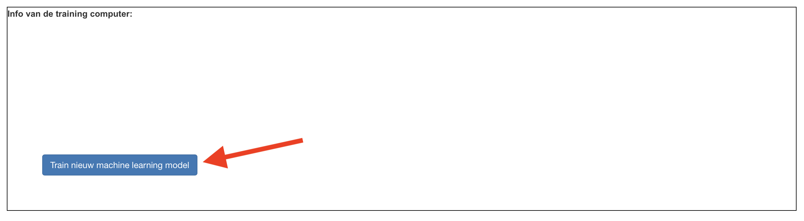
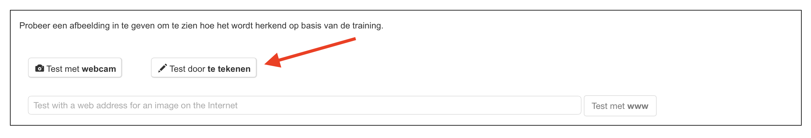

## Train het model

<html>
  

    <iframe style="position: absolute; top: 0; left: 0; right: 0; width: 100%; height: 100%; border: none;" src="https://www.youtube.com/embed/vUL2ebQO0ww?rel=0&cc_load_policy=1" allowfullscreen allow="accelerometer; autoplay; clipboard-write; encrypted-media; gyroscope; picture-in-picture; web-share"></iframe>
  

</html>

Je moet enkele voorbeelden verzamelen om de computer te trainen.

\--- task ---

- Klik op **Terug naar project** in de linkerbovenhoek.

- Klik op **Leer & Test**.

- Klik op de knop met het label **Train nieuw machine learning model**. Dit kan enkele minuten duren.
  

\--- /task ---

Once the training has finished, you can test how well your model recognises drawings of each type of object.

\--- task ---

- Click the **Test by drawing** button, then draw a picture of an apple.

Your machine learning model will display its prediction for what you drew.

\--- /task ---

\--- task ---

- Test whether the model recognises a drawing of a banana as well.

\--- /task ---

If you are not happy with how the model is working, go back to the **Train** page and add more examples, then train your model again.

