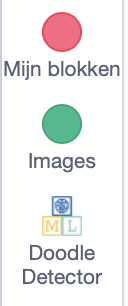
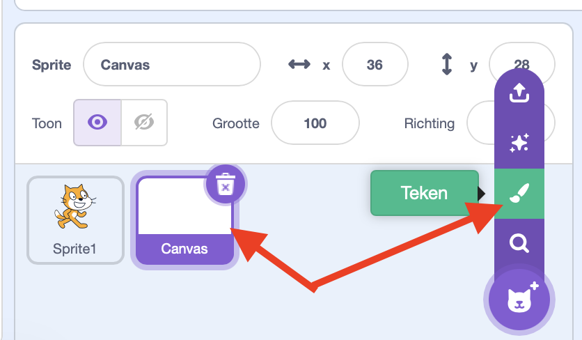
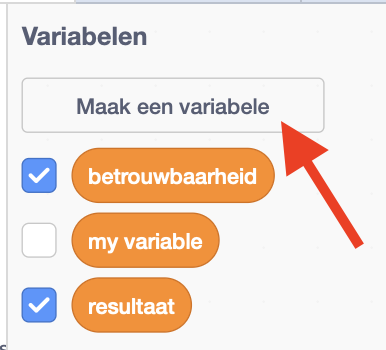
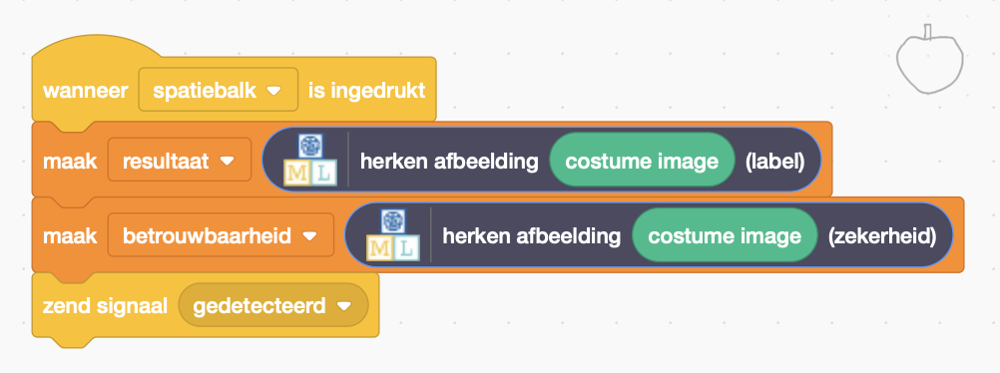

## Maak een canvas

<html>
  

    <iframe style="position: absolute; top: 0; left: 0; right: 0; width: 100%; height: 100%; border: none;" src="https://www.youtube.com/embed/VnE5kMsPJOI?rel=0&cc_load_policy=1" allowfullscreen allow="accelerometer; autoplay; clipboard-write; encrypted-media; gyroscope; picture-in-picture; web-share"></iframe>
  

</html>

Nu je model het onderscheid kan maken tussen verschillende tekeningen, kun je het gebruiken in een Scratch-programma.

\--- task ---

- Klik op de link **< Terug naar project**.

- Klik op **Maak**.

- Klik op **Scratch 3**.

- Klik op **Open in Scratch 3**.

\--- /task ---

Machine Learning for Kids heeft een paar speciale blokken aan Scratch toegevoegd om het model dat je net hebt getraind te kunnen gebruiken. Je vindt ze onderaan de lijst met blokken.

\--- task ---

- Maak een nieuwe sprite met de optie 'Teken'. Noem je sprite 'Canvas'.
  

\--- /task ---

\--- task ---

- Klik op de paarse knop **Zet om naar bitmap** onderaan, onder het tekengebied.

\--- /task ---

\--- task ---

- Klik op het **Code tabblad** voor de canvas sprite en maak twee **variabelen** aan met de naam 'resultaat' en 'betrouwbaarheid'.

\--- /task ---

\--- task ---

- Versleep de juiste blokken om de waarde van deze variabelen in te stellen wanneer de spatiebalk wordt ingedrukt. Maak een **zend signaal** aan met de naam `gedetecteerd` en zend deze uit zodra de variabelen zijn ingesteld.

\--- /task ---

