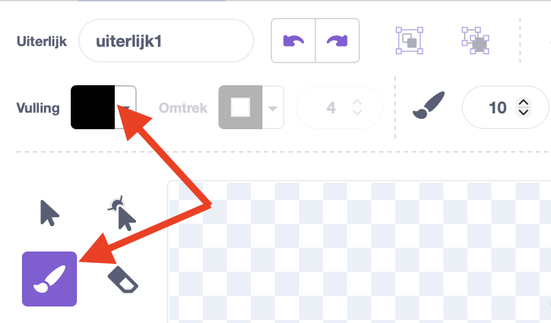
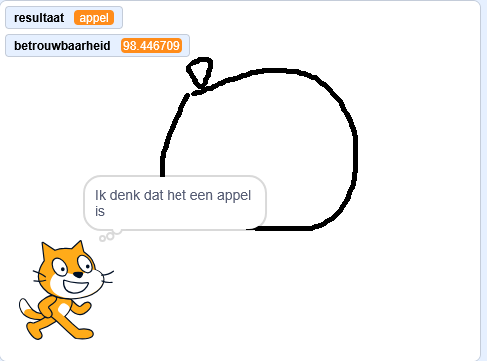
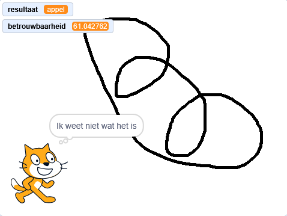

## Wat was het?

<html>
  <div style="position: relative; overflow: hidden; padding-top: 56.25%;">
    <iframe style="position: absolute; top: 0; left: 0; right: 0; width: 100%; height: 100%; border: none;" src="https://www.youtube.com/embed/r1ZBEUrheus?rel=0&cc_load_policy=1" allowfullscreen allow="accelerometer; autoplay; clipboard-write; encrypted-media; gyroscope; picture-in-picture; web-share"></iframe>
  </div>
</html>

De kat sprite zal aankondigen wat hij voorspelt dat je hebt getekend.

\--- task ---

- Klik op de kat sprite. Voeg wat code toe, zodat de kat je vertelt wat hij denkt dat je hebt getekend.

```blocks3
when I receive [detected v]
think (join [I predict it's a...] (result)) for (2) seconds
```

\--- /task ---

\--- task ---

- Klik op de canvas sprite en klik vervolgens op het **Uiterlijken tabblad**.

- Selecteer het **kwast**-gereedschap en verander de **vulling** kleur naar zwart.
  

\--- /task ---

\--- task ---

- Teken met de kwast een grote appel. Als je klaar bent, druk je op de spatiebalk en kijk je wat de kat denkt dat je hebt getekend.



\--- /task ---

\--- task ---

- Je kunt meer code toevoegen zodat de kat sprite je alleen het resultaat vertelt als het betrouwbaarheidsniveau boven de 70 ligt.

```blocks3
when I receive [detected v]
if <(confidence)>(70)> then
think (join [I predict it's a...] (result)) for (2) seconds
else
think [I don't know what that is] for (2) seconds
```

\--- /task ---

\--- task ---

- Klik op het canvas en teken deze keer iets heel anders. Kijk of de kat denkt dat je een appel of een banaan hebt getekend, of dat hij het niet zeker weet.



\--- /task ---
