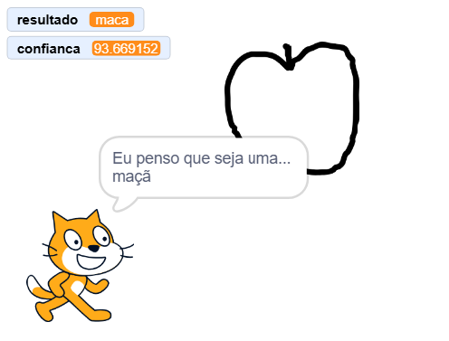

## O que vais fazer

Treina um modelo de Machine Learning para reconhecer o que estás a desenhar.

\--- collapse ---

---

## title: Onde estão guardadas as minhas imagens?

- Este projeto usa uma tecnologia chamada 'machine learning'. Os sistemas de machine learning são treinados com uma grande quantidade de dados.
- Este projeto não exige que cries uma conta ou faças login. Para este projeto, as imagens de exemplo que usas para o modelo são armazenadas temporariamente no teu navegador (apenas na tua máquina).

\--- /collapse ---

## --- collapse ---

## title: Não tens Youtube? Descarrega estes vídeos!

Podes [descarregar todos os vídeos para este projeto](https://rpf.io/p/en/doodle-detector-go){:target="_blank"}.

\--- /collapse ---