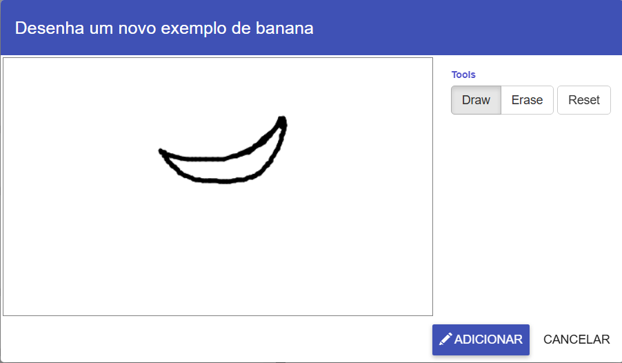
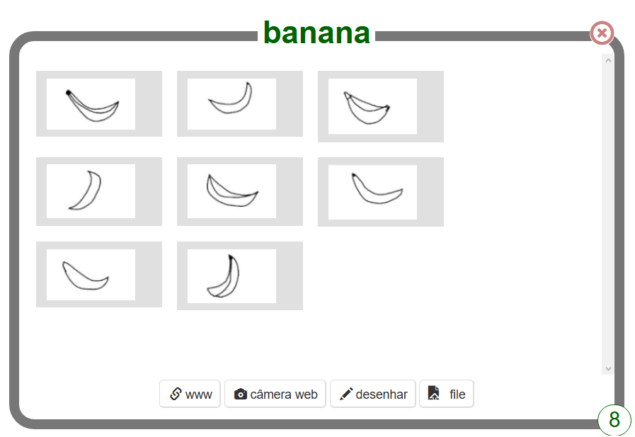

## Desenha alguns exemplos

<html>
  

    <iframe style="position: absolute; top: 0; left: 0; right: 0; width: 100%; height: 100%; border: none;" src="https://www.youtube.com/embed/Y_2luFeY89w?rel=0&cc_load_policy=1" allowfullscreen allow="accelerometer; autoplay; clipboard-write; encrypted-media; gyroscope; picture-in-picture; web-share"></iframe>
  

</html>

Vai desenhar duas imagens diferentes várias vezes. Isto irá ensinar o teu modelo de machine learning a distinguir as duas coisas que irás desenhar. Escolhemos uma banana e uma maçã, mas pode escolher outras coisas para desenhar, se preferires.

\--- task ---

- Clica em **+ Adicionar um novo rótulo** no canto superior direito do ecrã e adiciona um rótulo chamado `banana`.

\--- /task ---

\--- task ---

- Clica no botão **Desenhar** em **banana**.

\--- /task ---

\--- task ---

- Desenhe uma banana na caixa.

- Clica no botão **Adicionar** para guardar o teu desenho.

\--- /task ---

\--- task ---

- Repete estes passos até teres **pelo menos oito exemplos** de bananas. Tenta desenhá-los de diferentes formas para que haja variedade.
  images/8-banana.png

\--- /task ---

\--- task ---

- Clica em **+ Adicionar um novo rótulo** no canto superior direito do ecrã e adiciona um rótulo chamado `maçã`.

\--- /task ---

\--- task ---

- Clica em **Desenhar** dentro da caixa para o novo rótulo `maçã` e desenha uma maçã.

- Repite até teres desenhado **pelo menos oito exemplos** de maçãs.

\--- /task ---

