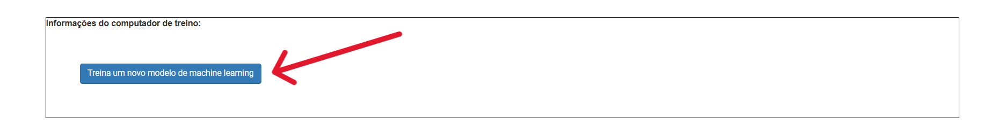
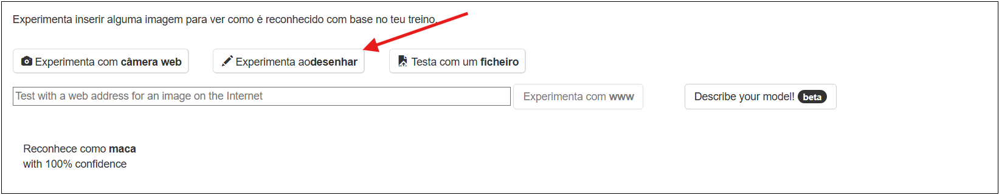

## Treina o modelo

<html>
  

    <iframe style="position: absolute; top: 0; left: 0; right: 0; width: 100%; height: 100%; border: none;" src="https://www.youtube.com/embed/vUL2ebQO0ww?rel=0&cc_load_policy=1" allowfullscreen allow="accelerometer; autoplay; clipboard-write; encrypted-media; gyroscope; picture-in-picture; web-share"></iframe>
  

</html>

Reuniste os exemplos de que precisas, e agora vais usar esses exemplos para treinar o teu modelo de machine learning.

\--- task ---

- Clica em **< Voltar para o projeto** no canto superior esquerdo.

- Clica em **Aprender & testar**.

- Clica no botão chamado **Treinar um novo modelo de Machine Learning**. Isto pode demorar alguns minutos até acontecer.
  

\--- /task ---

Quando o treino terminar, podes testa se o teu modelo reconhece desenhos de cada tipo de objeto.

\--- task ---

- Clica no botão **Testar desenhando** e desenha uma maçã.

O teu modelo de machine learning irá apresentar a sua previsão para o que desenhas-te.

\--- /task ---

\--- task ---

- Testa se o modelo também reconhece um desenho de uma banana.

\--- /task ---

Se não ficares satisfeito com o funcionamento do modelo, volta à página Treinar e adiciona mais exemplos, depois treina o modelo outra vez.

