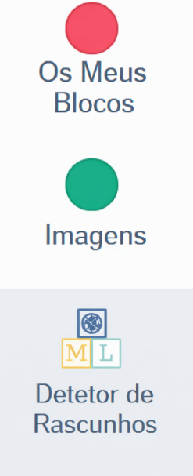
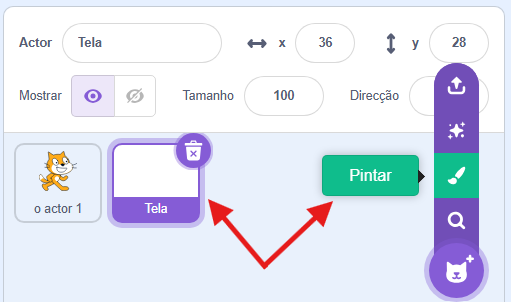
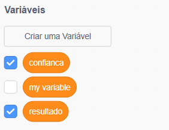
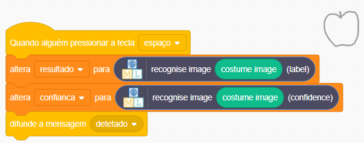

## Cria uma tela

<html>
  

    <iframe style="position: absolute; top: 0; left: 0; right: 0; width: 100%; height: 100%; border: none;" src="https://www.youtube.com/embed/VnE5kMsPJOI?rel=0&cc_load_policy=1" allowfullscreen allow="accelerometer; autoplay; clipboard-write; encrypted-media; gyroscope; picture-in-picture; web-share"></iframe>
  

</html>

Agora que o teu modelo consegue distinguir entre desenhos, podes usá-lo num programa Scratch.

\--- task ---

- Clica no link **< Voltar para o projeto**.

- Clica em **Fazer**.

- Clica em **Scratch 3**.

- Clica em **Abrir no Scratch 3**.

\--- /task ---

Machine learning for Kids acrescentou alguns blocos especiais ao Scratch para permitir que utilizes o modelo que acabaste de treinar. Vais encontrar os blocos na última parte da lista.

\--- task ---

- Cria um novo ator utilizando a opção "Pintar". Muda o nome do teu ator para "Tela".
  

\--- /task ---

\--- task ---

- Clica no botão roxo **Converter para bitmap** na parte inferior, abaixo da área de desenho.

\--- /task ---

\--- task ---

- Clica no **separador Código** do ator tela e crie duas **variáveis** chamadas `resultado` e `confiança`.

\--- /task ---

\--- task ---

- Arrasta os blocos corretos para definir o valor destas variáveis quando a tecla de espaço é pressionada. Cria uma **mensagem** chamada `detetada` e transmite-a assim que as variáveis estiverem definidas.

\--- /task ---

