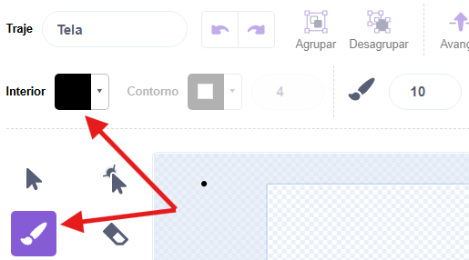
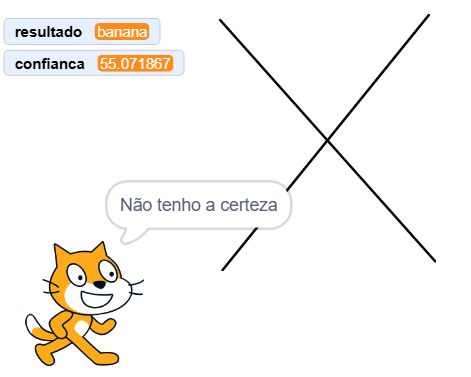

## O que era?

<html>
  <div style="position: relative; overflow: hidden; padding-top: 56.25%;">
    <iframe style="position: absolute; top: 0; left: 0; right: 0; width: 100%; height: 100%; border: none;" src="https://www.youtube.com/embed/r1ZBEUrheus?rel=0&cc_load_policy=1" allowfullscreen allow="accelerometer; autoplay; clipboard-write; encrypted-media; gyroscope; picture-in-picture; web-share"></iframe>
  </div>
</html>

O ator gato irá anunciar o que prevê teres desenhado.

\--- task ---

- Clica no ator gato. Acrescenta código para que o gato diga o que prevê teres desenhado.

```blocks3
when I receive [detected v]
think (join [I predict it's a...] (result)) for (2) seconds
```

\--- /task ---

\--- task ---

- Clica no ator tela e a seguir clica na aba **trajes**.

- Seleciona a ferramenta **pincel** e altera a cor de **preenchimento** para preto.
  

\--- /task ---

\--- task ---

- Utiliza o pincel para desenhar uma maçã grande. Quando terminares, pressiona a barra de espaço e vê o que o gato prevê teres desenhado.


\--- /task ---

\--- task ---

- Pode usar mais código para que o ator gato só mostre o resultado se o nível de confiança for superior a 70.

```blocks3
when I receive [detected v]
if <(confidence)>(70)> then
think (join [I predict it's a...] (result)) for (2) seconds
else
think [I don't know what that is] for (2) seconds
```

\--- /task ---

\--- task ---

- Clica na tela e desta vez desenha algo completamente diferente. Vê se o gato pensa teres desenhado uma maçã, uma banana ou não tem a certeza.



\--- /task ---
