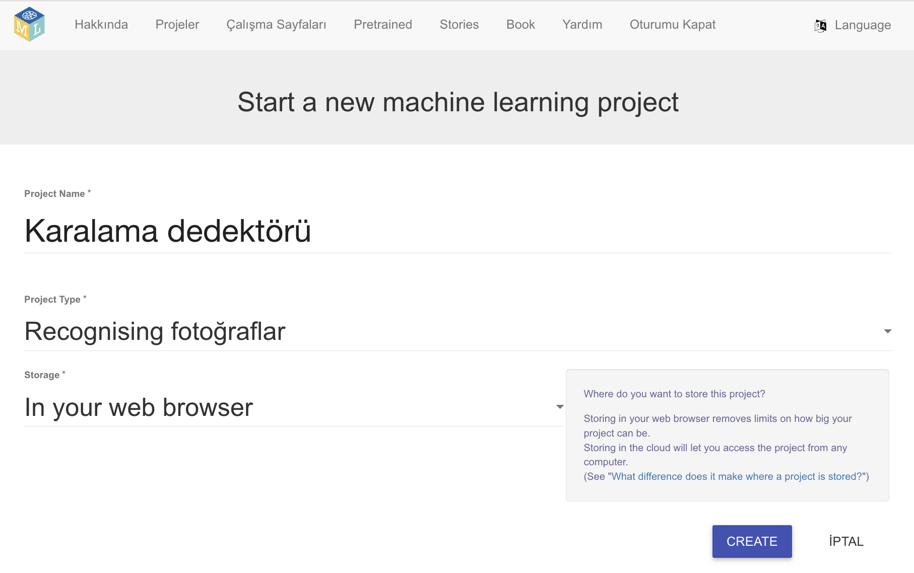
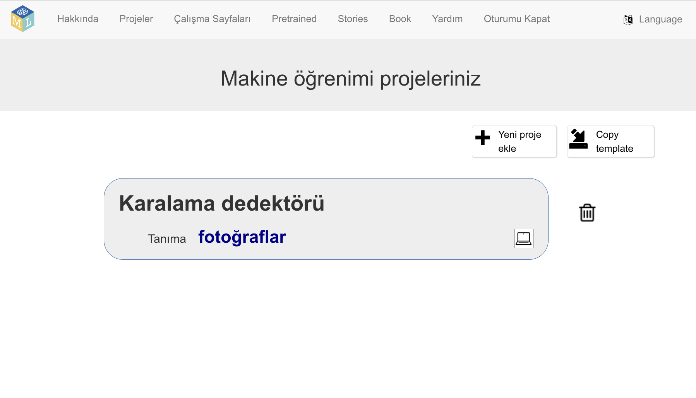
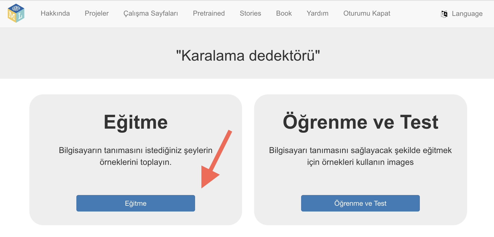

## Projeyi kurun

<html>
  

    <iframe style="position: absolute; top: 0; left: 0; right: 0; width: 100%; height: 100%; border: none;" src="https://www.youtube.com/embed/jXLQt079DNY?rel=0&cc_load_policy=1" allowfullscreen allow="accelerometer; autoplay; clipboard-write; encrypted-media; gyroscope; picture-in-picture; web-share"></iframe>
  

</html>

--- task ---

- Bir web tarayıcısında [machinelearningforkids.co.uk](https://machinelearningforkids.co.uk/){:target="_blank"} adresine gidin.

- **Başla** seçeneğine tıklayın.

- **Şimdi dene**'ye tıklayın.

--- /task ---

--- task ---

- Üstteki menü çubuğunda **Projeler**'e tıklayın.

- **+ Yeni proje ekle** düğmesine tıklayın.

- Projenize `Karalama dedektörü` adını verin ve **görüntüleri** tanımayı öğrenmesi ve verileri **web tarayıcınızda** saklaması için ayarlayın. Ardından **Oluştur**'a tıklayın.

- Artık projeler listesinde 'Karalama dedektörü'nü görmelisiniz. Projeye tıklayın.

--- /task ---

--- task ---

- **Eğit** düğmesine tıklayın.

--- /task ---

