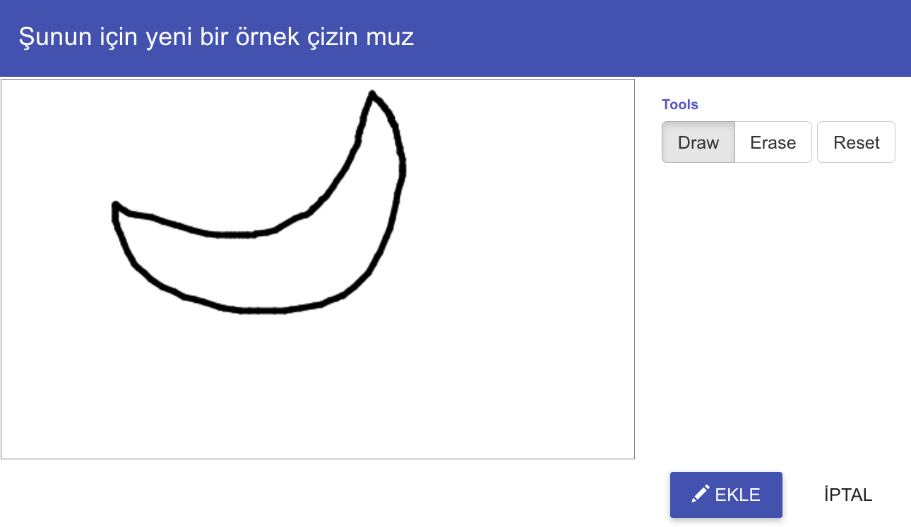
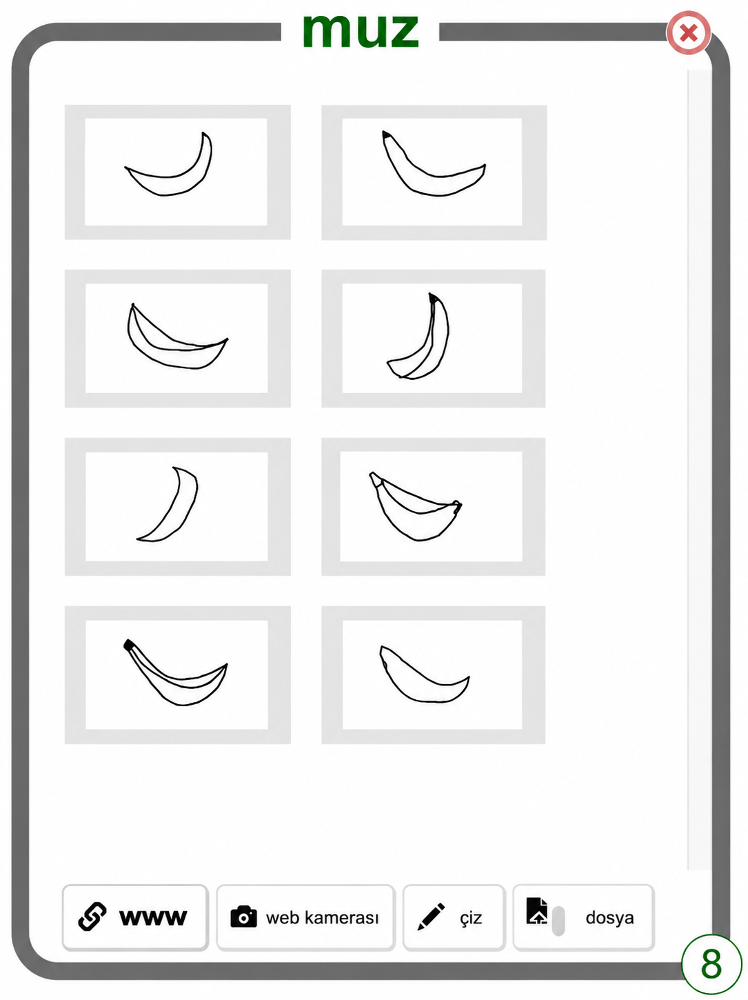

## Bazı örnekler çizin

<html>
  

    <iframe style="position: absolute; top: 0; left: 0; right: 0; width: 100%; height: 100%; border: none;" src="https://www.youtube.com/embed/Y_2luFeY89w?rel=0&cc_load_policy=1" allowfullscreen allow="accelerometer; autoplay; clipboard-write; encrypted-media; gyroscope; picture-in-picture; web-share"></iframe>
  

</html>

Birkaç kez iki farklı resim çizeceksiniz. Bu, makine öğrenmesi modelinize çizeceğiniz iki şey arasındaki farkı ayırt etmeyi öğretecektir. Biz muz ve elma seçtik, ancak isterseniz başka şeyler de çizebilirsiniz.

--- task ---

- Ekranın sağ üst köşesindeki **+ Yeni etiket ekle** seçeneğine tıklayın ve `muz` adında bir etiket ekleyin.

--- /task ---

--- task ---

- **muz** içindeki **Çizim** düğmesine tıklayın.

--- /task ---

--- task ---

- Kutunun içine bir muz resmi çizin.

- Çiziminizi kaydetmek için **Ekle** düğmesine tıklayın.

--- /task ---

--- task ---

- **En az sekiz** muz örneği elde edene kadar bu adımları tekrarlayın. Çeşitlilik sağlamak için onları farklı şekillerde çizmeyi deneyin.
  

--- /task ---

--- task ---

- Ekranın sağ üst köşesindeki **+ Yeni etiket ekle** seçeneğine tıklayın ve `elma` adında bir etiket ekleyin.

--- /task ---

--- task ---

- Yeni `elma` etiketi için kutunun içindeki **Çiz** seçeneğine tıklayın ve bir elma resmi çizin.

- **En az sekiz** elma resmi çizene kadar işlemi tekrarlayın.

--- /task ---

