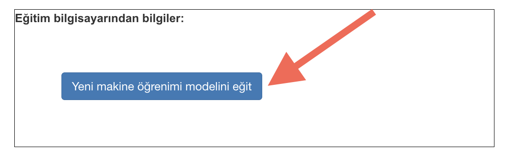
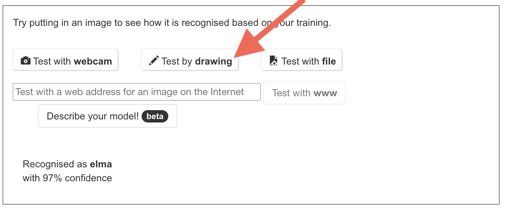

## Modelin eğitin

<html>
  

    <iframe style="position: absolute; top: 0; left: 0; right: 0; width: 100%; height: 100%; border: none;" src="https://www.youtube.com/embed/vUL2ebQO0ww?rel=0&cc_load_policy=1" allowfullscreen allow="accelerometer; autoplay; clipboard-write; encrypted-media; gyroscope; picture-in-picture; web-share"></iframe>
  

</html>

İhtiyacınız olan örnekleri topladınız, şimdi bu örnekleri kullanarak makine öğrenimi modelinizi eğiteceksiniz.

\--- task ---

- Sol üst köşedeki **< Projeye geri dön** seçeneğine tıklayın.

- **Öğren ve Test Et** seçeneğine tıklayın.

- **Yeni makine öğrenimi modeli eğit** etiketli butona tıklayın. Bu işlem birkaç dakika sürebilir.
  

\--- /task ---

Eğitim tamamlandıktan sonra, modelinizin her nesne türünün çizimlerini ne kadar iyi tanıdığını test edebilirsiniz.

\--- task ---

- **Çizerek test et** düğmesine tıklayın, ardından bir elma resmi çizin.

Makine öğrenme modeliniz, çizdiğiniz şey için tahminini gösterecektir.

\--- /task ---

\--- task ---

- Modelin muz çizimini de tanıyıp tanımadığını test edin.

\--- /task ---

Modelin çalışma şeklinden memnun değilseniz, **Eğit** sayfasına geri dönün, daha fazla örnek ekleyin ve modelinizi tekrar eğitin.

