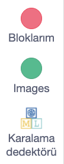
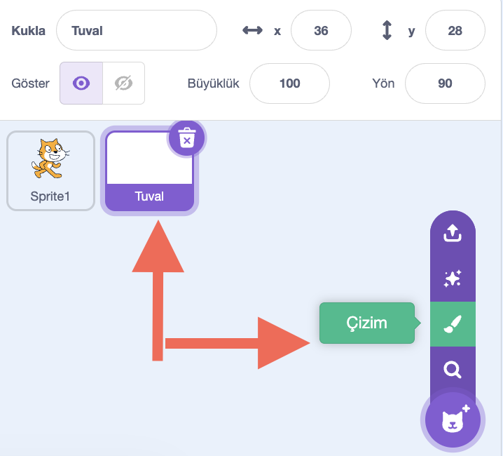
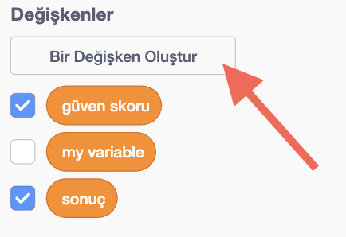
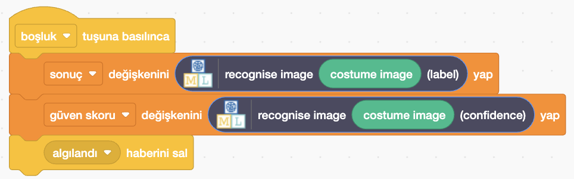

## Bir tuval oluşturun

<html>
  

    <iframe style="position: absolute; top: 0; left: 0; right: 0; width: 100%; height: 100%; border: none;" src="https://www.youtube.com/embed/VnE5kMsPJOI?rel=0&cc_load_policy=1" allowfullscreen allow="accelerometer; autoplay; clipboard-write; encrypted-media; gyroscope; picture-in-picture; web-share"></iframe>
  

</html>

Modeliniz artık çizimler arasında ayrım yapabildiğine göre, onu bir Scratch programında kullanabilirsiniz.

\--- task ---

- **< Projeye geri dön** bağlantısına tıklayın.

- **Oluştur** seçeneğine tıklayın.

- **Scratch 3**'e tıklayın.

- **Scratch 3'te Aç** seçeneğine tıklayın.

\--- /task ---

Çocuklar için Makine Öğrenimi, yeni eğittiğiniz modeli kullanmanıza olanak sağlamak için Scratch'e bazı özel bloklar ekledi. Onları blok listesinin en altında bulabilirsiniz.

\--- task ---

- 'Boyama' seçeneğini kullanarak yeni bir karakter oluşturun. Karakterinizin adını 'Tuval' olarak belirleyin.
  

\--- /task ---

\--- task ---

- Çizim alanının altında, en altta bulunan mor **Bitmap'e dönüştür** düğmesine tıklayın.

\--- /task ---

\--- task ---

- Tuval karakteri için **Kod sekmesi**ne tıklayın ve `sonuç` ve `güven skoru` adında iki **değişken** oluşturun.

\--- /task ---

\--- task ---

- Boşluk tuşuna basıldığında bu değişkenlerin değerini ayarlamak için doğru blokları sürükleyin. `tanındı` adında bir **yayın** oluşturun ve değişkenler ayarlandıktan sonra yayınlayın.

\--- /task ---

