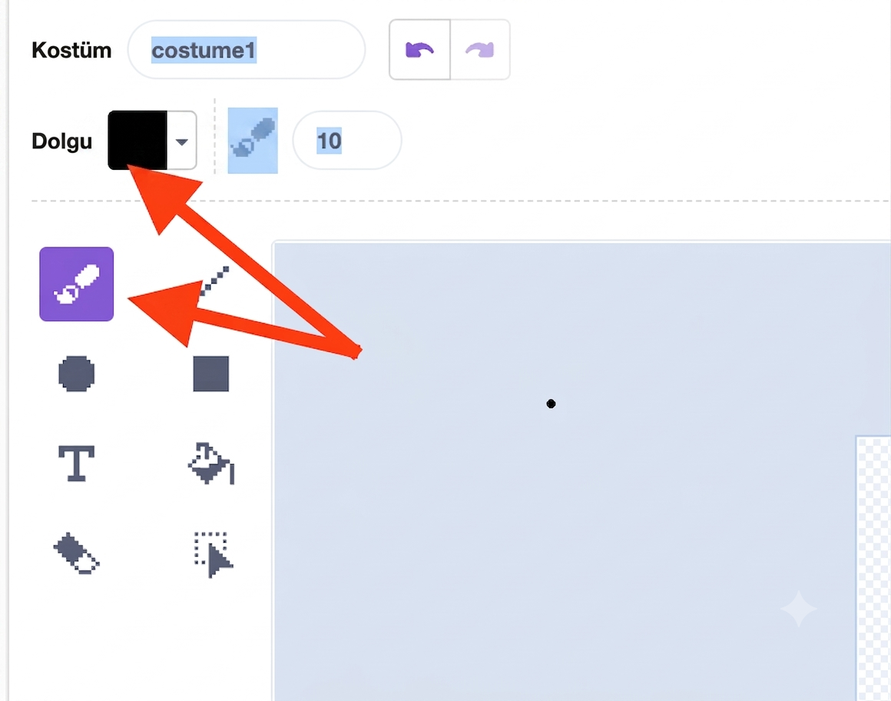
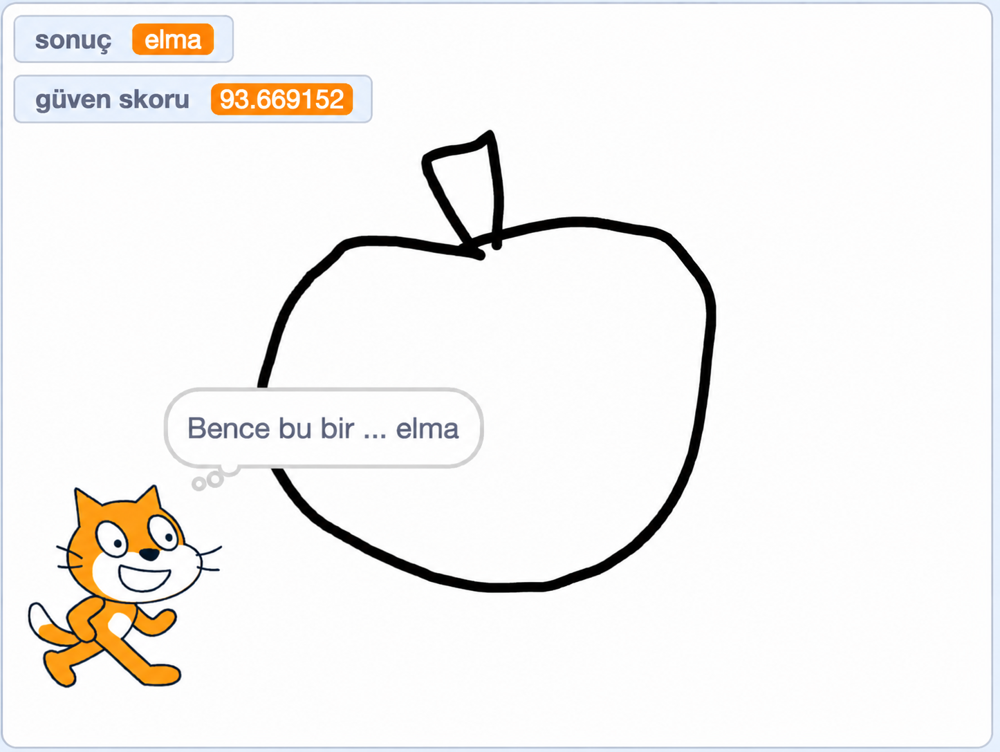
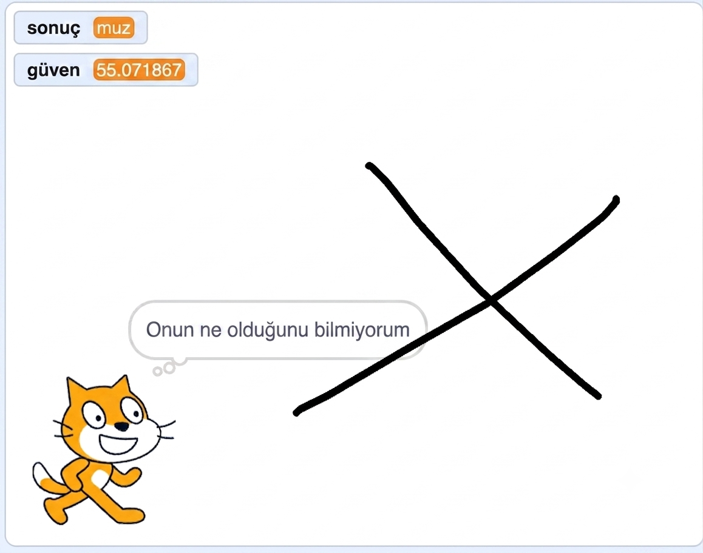

## Neydi o?

<html>
  <div style="position: relative; overflow: hidden; padding-top: 56.25%;">
    <iframe style="position: absolute; top: 0; left: 0; right: 0; width: 100%; height: 100%; border: none;" src="https://www.youtube.com/embed/r1ZBEUrheus?rel=0&cc_load_policy=1" allowfullscreen allow="accelerometer; autoplay; clipboard-write; encrypted-media; gyroscope; picture-in-picture; web-share"></iframe>
  </div>
</html>

Kedi karakteri, çizdiğiniz şeyin ne olduğunu tahmin ederek size haber verecektir.

--- task ---

- Kedi karakterine tıklayın. Kedinin çizdiğiniz şeyi tahmin etmesini sağlayacak bir kod ekleyin.

```blocks3
when I receive [algılandı v]
think (join [Tahminimce bu bir...] (sonuç)) for (2) seconds
```

--- /task ---

--- task ---

- Tuval karakterine tıklayın, ardından **kostümler sekmesi**ne tıklayın.

- **Boya fırçası** aracını seçin ve **dolgu** rengini siyaha değiştirin.


--- /task ---

--- task ---

- Boya fırçasını kullanarak büyük bir elma çizin. İşiniz bittiğinde boşluk tuşuna basın ve kedinin ne çizdiğinizi tahmin ettiğini görün.



--- /task ---

--- task ---

- Sadece güven seviyesi %70'in üzerinde olduğunda kedi karakterinin size sonucu bildirmesini sağlayacak şekilde daha fazla kod ekleyebilirsiniz.

```blocks3
when I receive [algılandı v]
if <(güven skoru)>(70)> then
think (join [Tahminimce bu bir...] (sonuç)) for (2) seconds
else
think [Onun ne olduğunu bilmiyorum] for (2) seconds
```

--- /task ---

--- task ---

- Tuvalin üzerine tıklayın ve bu sefer tamamen farklı bir şey çizin. Bakalım kedi elma mı, muz mu çizdiğinizi düşünüyor, yoksa emin değil mi.



--- /task ---
