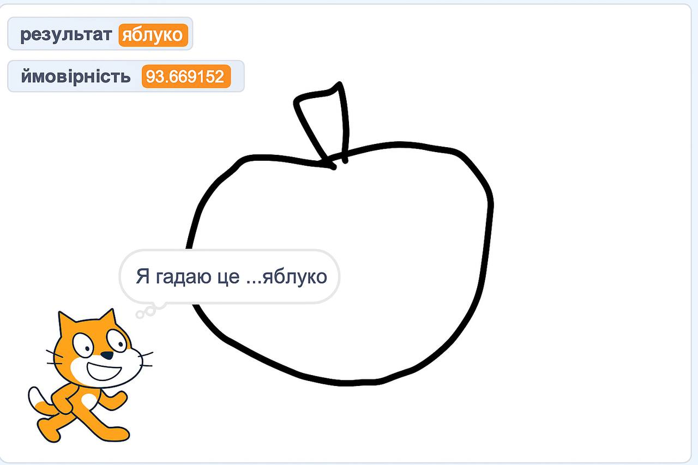

## Що ти зробиш

Навчи комп'ютер розпізнавати твої малюнки.

\--- collapse ---

---

## title: Де зберігаються мої зображення?

- Цей проєкт використовує технологію під назвою «машинне навчання». Системи машинного навчання навчаються з використанням великої кількості даних.
- Для цього проєкту тобі не потрібно створювати обліковий запис або входити в систему. У цьому проєкті приклади зображень, які ти використовуєш для створення моделі, лише тимчасово зберігаються у твоєму браузері (лише на твоєму компʼютері).

\--- /collapse ---

## --- collapse ---

## title: Немає доступу до YouTube? Завантаж відео!

Ти можеш [завантажити всі відео для цього проєкту](https://rpf.io/p/en/doodle-detector-go){:target="_blank"}.

\--- /collapse ---