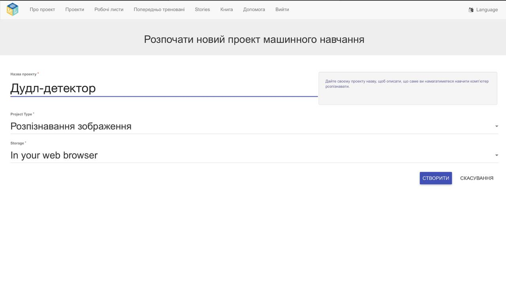
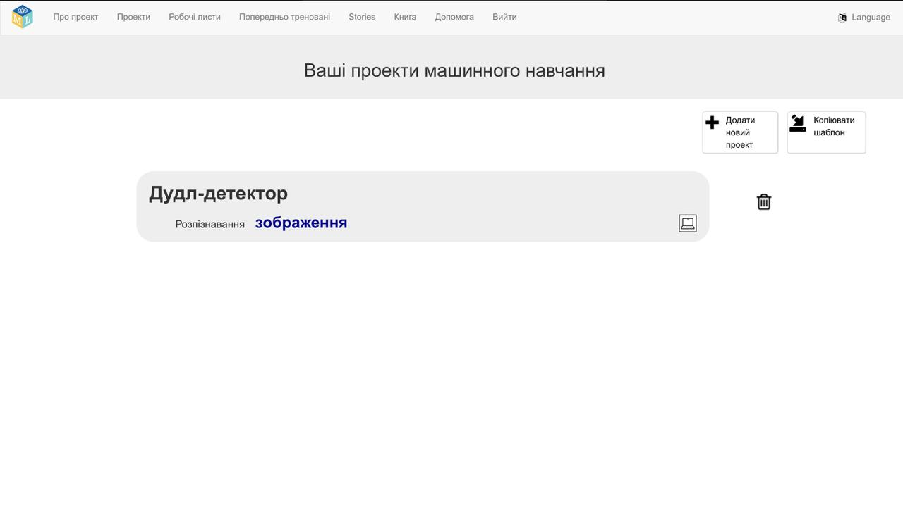

## Створи проєкт

<html>
  

    <iframe style="position: absolute; top: 0; left: 0; right: 0; width: 100%; height: 100%; border: none;" src="https://www.youtube.com/embed/jXLQt079DNY?rel=0&cc_load_policy=1" allowfullscreen allow="accelerometer; autoplay; clipboard-write; encrypted-media; gyroscope; picture-in-picture; web-share"></iframe>
  

</html>

\--- task ---

- Перейди на [machinelearningforkids.co.uk](https://machinelearningforkids.co.uk/){:target="_blank"} у браузері.

- Натисни **Почати**.

- Натисни **Спробувати**.

\--- /task ---

\--- task ---

- Натисни **Проєкти** на панелі меню зверху.

- Натисни кнопку **+ Додати новий проєкт**.

- Назви свій проєкт "Дудл-детектор" та налаштуй його так, щоб він міг розпізнавати **зображення** та зберігати дані **у твоєму браузері**. Далі натисни кнопку **Створити**.
  

- Тепер у списку проєктів має висвітлюватися "Дудл-детектор". Натисни на проєкт.
  

\--- /task ---

\--- task ---

- Натисни кнопку **Навчити**.
  ![Головне меню проєкту зі стрілкою, що вказує на кнопку «Навчити»] (images/project-train.png)

\--- /task ---

