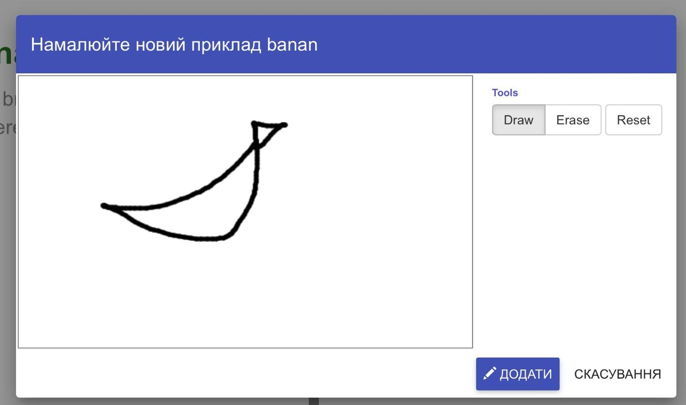
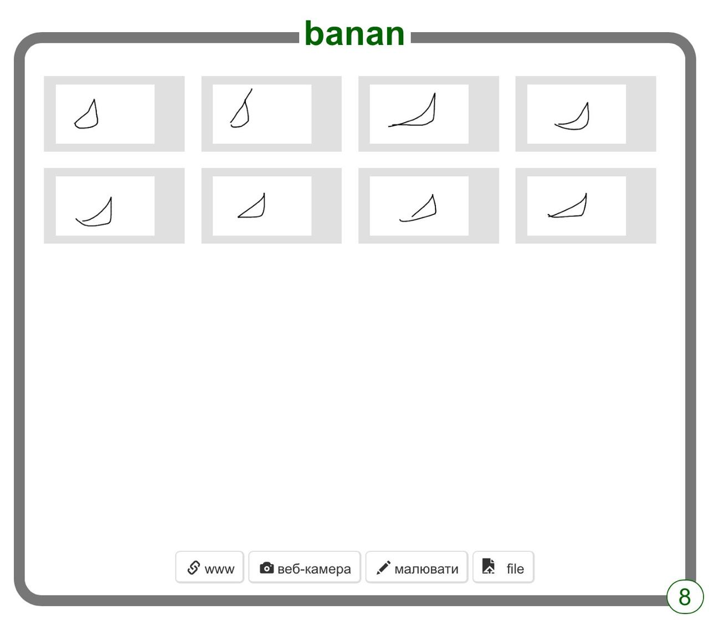

## Намалюй декілька прикладів

<html>
  

    <iframe style="position: absolute; top: 0; left: 0; right: 0; width: 100%; height: 100%; border: none;" src="https://www.youtube.com/embed/Y_2luFeY89w?rel=0&cc_load_policy=1" allowfullscreen allow="accelerometer; autoplay; clipboard-write; encrypted-media; gyroscope; picture-in-picture; web-share"></iframe>
  

</html>

Намалюй декілька разів два різні зображення. Це навчить твій комп'ютер розпізнавати різницю між двома речами, які ти намалюєш. Ми вибрали банан і яблуко, але ти можеш обрати намалювати інші предмети, якщо бажаєш.

\--- task ---

- Натисни **+ Додати нову мітку** у верхньому правому куті екрану і додай мітку з назвою "банан".

\--- /task ---

\--- task ---

- Натисніть кнопку **Малювати** у **банані**.

\--- /task ---

\--- task ---

- Намалюй банан у комірці.

- Натисни кнопку **Додати**, щоб зберегти малюнок.

\--- /task ---

\--- task ---

- Повторюй ці кроки поки не матимеш щонайменше вісім таких малюнків бананів. Спробуй намалювати їх по-різному для різноманіття.
  

\--- /task ---

\--- task ---

- Натисни **+ Додати нову мітку** у верхньому правому куті екрану і додай мітку з назвою "яблуко".

\--- /task ---

\--- task ---

- Натисни на **Малювати** всередині комірки для нової мітки «яблуко» та намалюй яблуко.

- Повторюй доки не намалюєш принаймні вісім зразків яблук.

\--- /task ---

