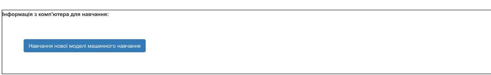
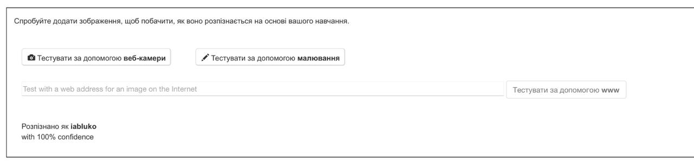

## Навчи модель

<html>
  

    <iframe style="position: absolute; top: 0; left: 0; right: 0; width: 100%; height: 100%; border: none;" src="https://www.youtube.com/embed/vUL2ebQO0ww?rel=0&cc_load_policy=1" allowfullscreen allow="accelerometer; autoplay; clipboard-write; encrypted-media; gyroscope; picture-in-picture; web-share"></iframe>
  

</html>

Необхідні зразки зібрано, тепер тобі треба їх використати, щоб натренувати свою модель машинного навчання.

\--- task ---

- Натисни **< Назад до проєкту** у верхньому лівому куті.

- Натисни \*_Дізнатися та перевірити_.

- Натисни кнопку **Навчання нової моделі машинного навчання**. Це може зайняти кілька хвилин.
  

\--- /task ---

Після завершення навчання ти можеш перевірити, як добре твоя модель розпізнає твої малюнки.

\--- task ---

- Натисніть **Тест картинки** та намалюйте яблуко.

Твоя модель машинного навчання покаже свій прогноз щодо того, що ти намалював.

\--- /task ---

\--- task ---

- Також перевір, чи розпізнає твоя модель малюнок банану.

\--- /task ---

Якщо ти не задоволений тим, як працює модель, то повернись на сторінку **Навчити** і додай більше зразків, а потім знову натренуй свою модель.

