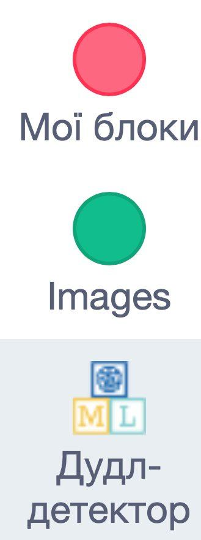
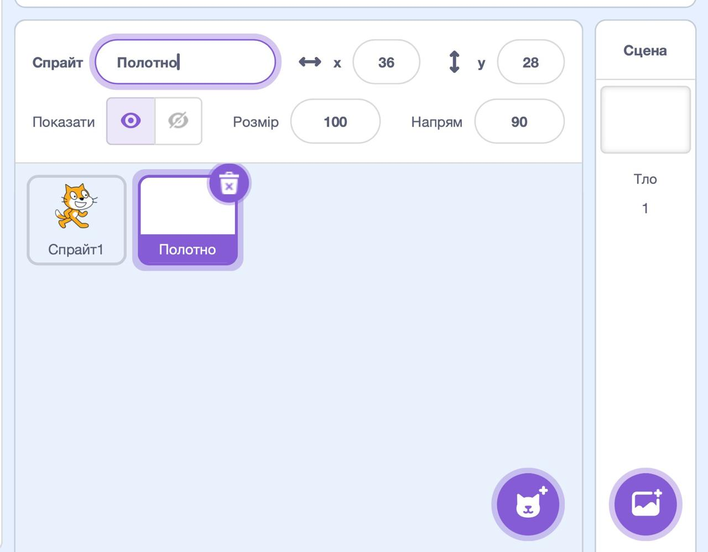
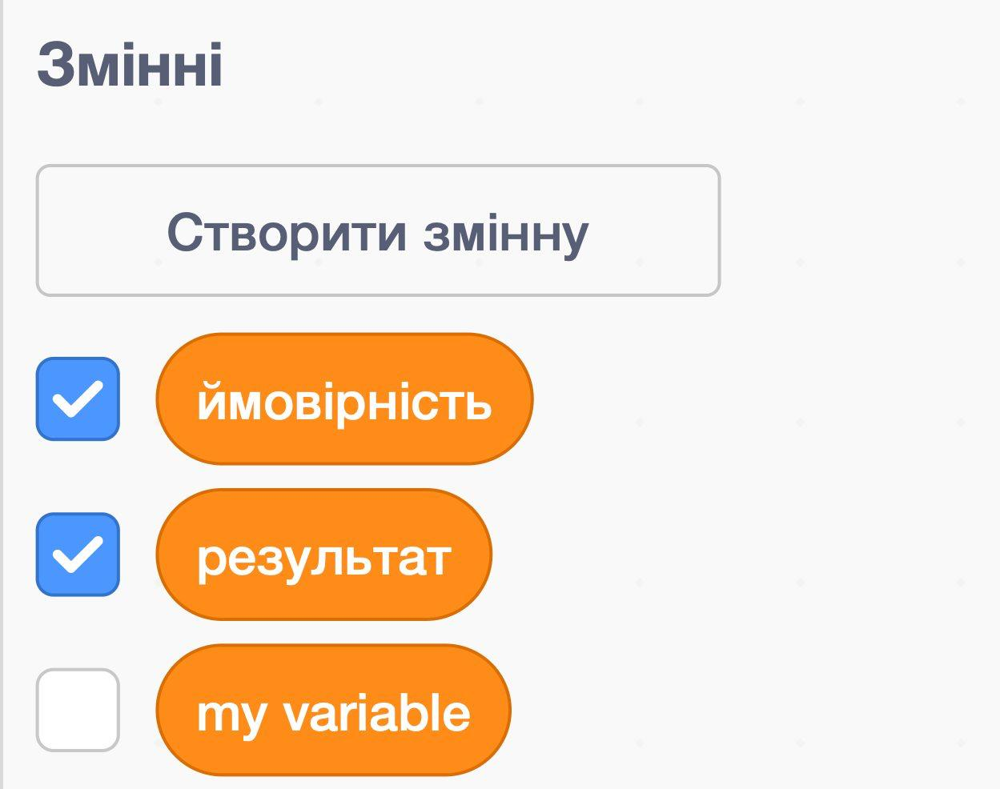
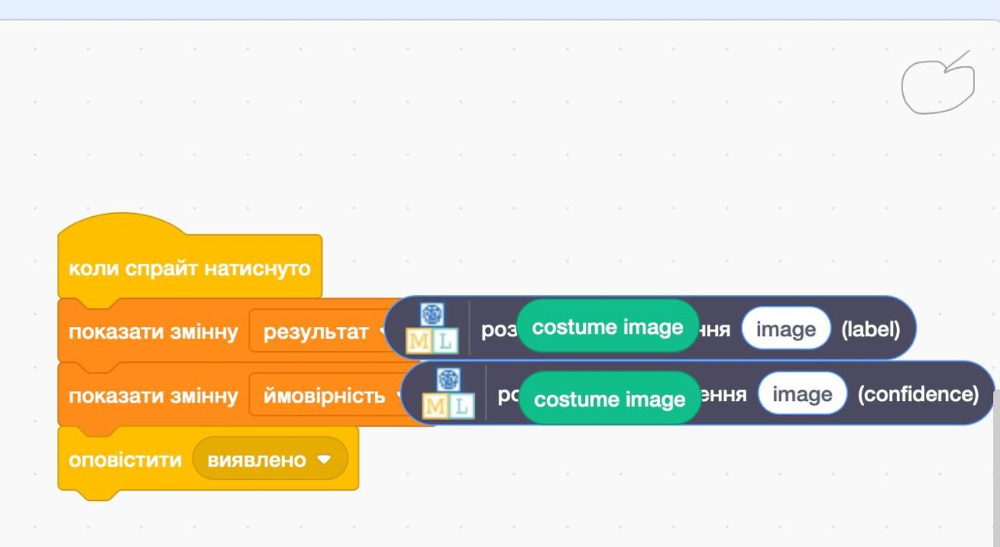

## Створи полотно

<html>
  

    <iframe style="position: absolute; top: 0; left: 0; right: 0; width: 100%; height: 100%; border: none;" src="https://www.youtube.com/embed/VnE5kMsPJOI?rel=0&cc_load_policy=1" allowfullscreen allow="accelerometer; autoplay; clipboard-write; encrypted-media; gyroscope; picture-in-picture; web-share"></iframe>
  

</html>

Тепер коли твоя модель може розрізняти два зображення, ти можеш її використати в програмі Scratch для керування інопланетянином.

\--- task ---

- Натисни **< Назад до проєкту**.

- Натисни **Створити**.

- Натисни **Scratch 3**.

- Натисни **Відкрити в Scratch 3**.

\--- /task ---

Програма «Машинне навчання для дітей» додала до Scratch кілька спеціальних блоків, які дозволяють використовувати щойно навчену модель. Знайди їх внизу у списку з блоками.

\--- task ---

- Створи новий спрайт, використовуючи опцію «Малювання». Назви свій спрайт «Полотно».
  

\--- /task ---

\--- task ---

- Натисни фіолетову кнопку **Конвертувати в растрове зображення** внизу, під зоною малювання.

\--- /task ---

\--- task ---

- Вибери вкладку **Код** для спрайта полотна та створи дві **змінні** з назвами `результат` та `ймовірність`.

\--- /task ---

\--- task ---

- Перетягни відповідні блоки, щоб встановити значення цих змінних після натискання клавіші пробілу. Створи **сигнал** під назвою `виявлено` та надішли його після встановлення змінних.

\--- /task ---

