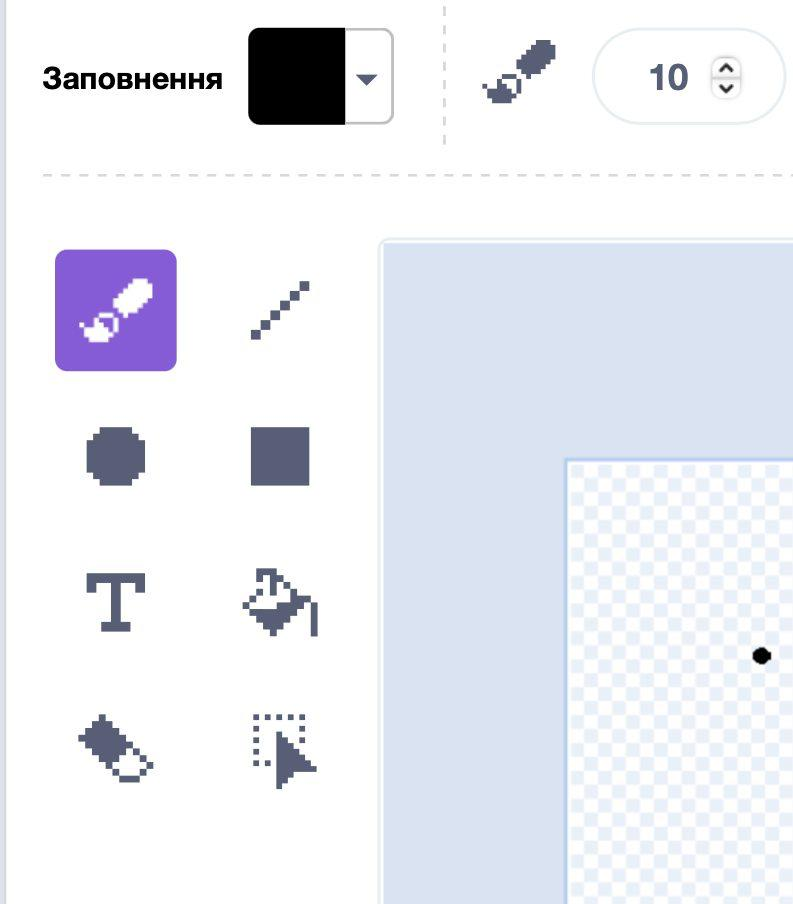
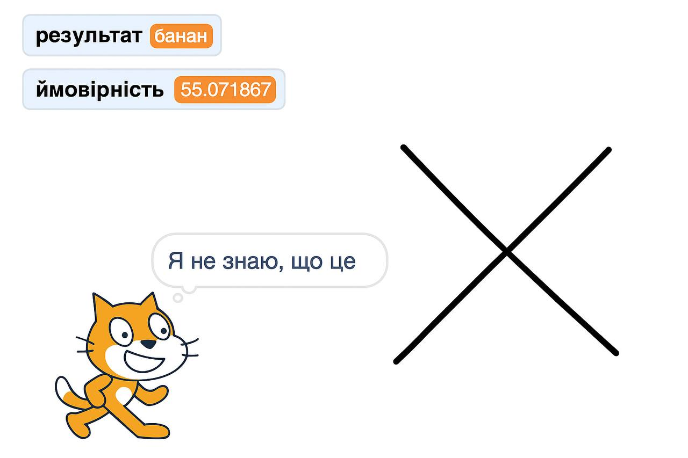

## Що це було?

<html>
  <div style="position: relative; overflow: hidden; padding-top: 56.25%;">
    <iframe style="position: absolute; top: 0; left: 0; right: 0; width: 100%; height: 100%; border: none;" src="https://www.youtube.com/embed/r1ZBEUrheus?rel=0&cc_load_policy=1" allowfullscreen allow="accelerometer; autoplay; clipboard-write; encrypted-media; gyroscope; picture-in-picture; web-share"></iframe>
  </div>
</html>

Спрайт показує, що, за його передбаченнями, ти намалював.

\--- task ---

- Натисни на спрайт. Додайте код, щоб кіт підказував, що, за його передбаченнями, ти намалював.

```blocks3
when I receive [detected v]
think (join [I predict it's a...] (result)) for (2) seconds
```

\--- /task ---

\--- task ---

- Натисни на спрайт полотна і перейди на вкладку **Костюми**.

- Вибери інструмент **пензель** та зміни колір **заливки** на чорний.
  

\--- /task ---

\--- task ---

- Використай пензлик, щоб намалювати велике яблуко. Коли закінчиш, натисни пробіл і подивись, що, за прогнозами кота, ти намалював.


\--- /task ---

\--- task ---

- Ти можеш додати інший код, щоб спрайт кота повідомляв результат, лише якщо рівень ймовірності перевищує 70.

```blocks3
when I receive [detected v]
if <(confidence)>(70)> then
think (join [I predict it's a...] (result)) for (2) seconds
else
think [I don't know what that is] for (2) seconds
```

\--- /task ---

\--- task ---

- Натисни на полотно та цього разу намалюй щось зовсім інше. Подивись, чи кіт вважає, що ти намалював яблуко, банан, чи він невпевнений.



\--- /task ---
